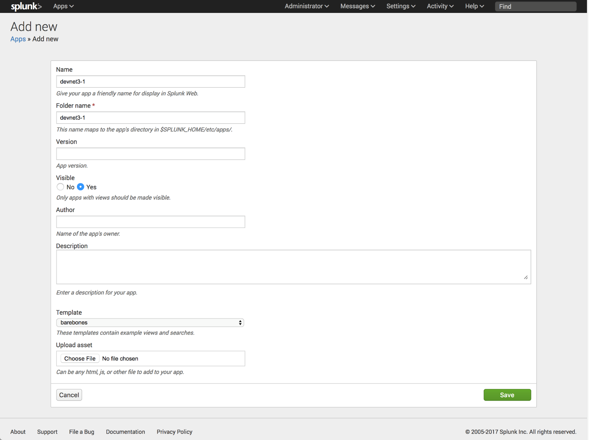

## Creating the Splunk App: ##

1.  Click on the **gear icon next to Apps** in the upper right hand corner of
    the UI. This will navigate you to the Apps page.

2.  Click on **‘Create app’**

3.  Enter the **name** for your app

4.  Enter the **directory** for your app.  Note the directory cannot contain spaces or special characters.

5.  Click **‘Save’**

