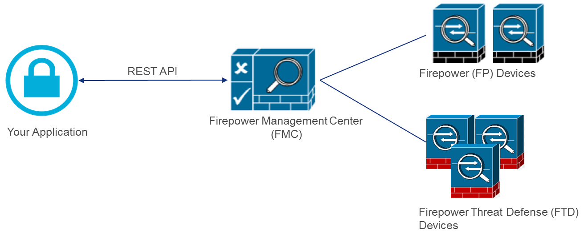
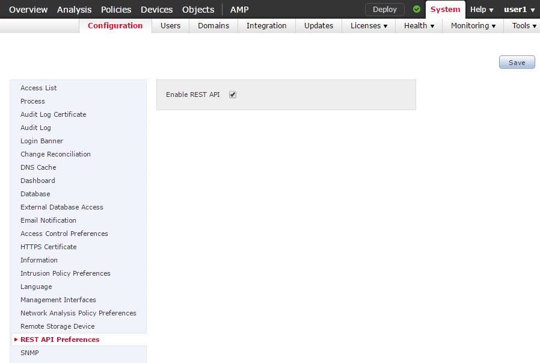

# What is Firepower Management Center?

Firepower Management Center (FMC) provides administrators with complete, unified control over firewall management, application control, intrusion prevention, URL filtering, and malware protection and remediation.

FMC versions 6.1 and later supplement the FMC web-based GUI with the first release of FMC REST APIs. These APIs enable administrators to integrate FMC with existing applications, and they also enable workflow automation.

## Enabling the FMC REST API

The FMC REST API must be enabled in your FMC setup, and it is enabled by default. It is also enabled by default in the [DevNet Sandbox](https://devnetsandbox.cisco.com/RM/Diagram/Index/1228cb22-b2ba-48d3-a70a-86a53f4eecc0?diagramType=Topology). For information about the sandbox, refer to "Obtaining a username and password for an FMC Sandbox" below.

If you need to manually enable FMC REST API, follow this procedure.

1. In your browser, navigate to FMC UI. The URL will be `https://<FMC_hostname_or_address>`.
2. From the **System** menu in the upper left corner, select the **Configuration** tab.
3. On the **Configuration** tab, select **REST API Preferences** and ensure that **Enable REST API** is selected.

## Obtaining a username and password for an FMC Sandbox

To log in to the FMC Sandbox, users must reserve lab time to obtain credentials. For more information refer to the [FMC Sandbox documentation](https://developer.cisco.com/docs/sandbox/#security/overview).

1. Navigate to [the DevNet REST API Sandbox with FMC](https://devnetsandbox.cisco.com/RM/Diagram/Index/1228cb22-b2ba-48d3-a70a-86a53f4eecc0?diagramType=Topology)
2. Log in with your DevNet credentials.
3. On the DevNet Sandbox page, click the **RESERVE** button.
4. In the Reserve dialog, accept the defaults and click **Reserve**. The Sandbox reservation setup process begins, and will take up to 5 minutes to complete.

When the setup process is complete, a username and password will be emailed to you and will be displayed in the output window on this page. You can now log into the API Explorer at https://fmcrestapisandbox.cisco.com/api/api-explorer/.

These credentials are valid for the duration of your reservation. You will not be able to use these temporary credentials when the reservation has ended, but if you require further access, repeat the reservation process.

**Next**: FMC API Explorer
