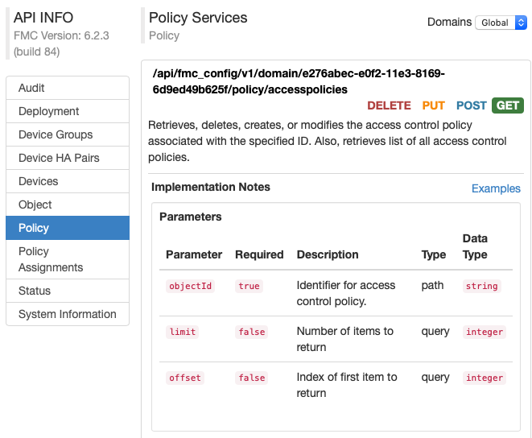

# FMC API Explorer

The FMC API Explorer provides a list of FMC REST APIs, describes those APIs, and provides a limited GUI. Each function in the REST API maps to permissions in the FMC GUI.

The API Explorer resides on the FMC, and can be accessed at: `https://<FMC_hostname_or_address>/api/api-explorer/`.

If you do not have an FMC instance, reserve a resource on the [FMC REST API Sandbox](https://devnetsandbox.cisco.com/RM/Diagram/Index/1228cb22-b2ba-48d3-a70a-86a53f4eecc0?diagramType=Topology). When you have reserved a resource, you can access the [API Explorer](https://fmcrestapisandbox.cisco.com/api/api-explorer/).

**Note**: The first time you connect to the API Explorer you may receive an error that states that the connection is not secure due to an invalid certificate. You will need to add an exception in your browser to use the certificate and accept the connection.

## Authentication to the API Explorer

FMC REST API uses token-based authentication. You need a valid access token to invoke a REST call, and every REST call must include a header in which `key` is set to `X-auth-access-token` and the `value` contains the access token. You can learn more in [FMC REST API Authentication](https://developer.cisco.com/learning/lab/firepower-restapi-102/step/1).

The API Explorer automates the access token process, and you can log into the API Explorer using any FMC account, but you will only be able to perform the functions for which the account has permissions. For more information on setting permissions for user roles, see the [Firepower Management Center Configuration Guide](http://www.cisco.com/c/en/us/td/docs/security/firepower/610/configuration/guide/fpmc-config-guide-v61/logging_into_firepower_system.html).

## Logging into FMC

To log into the API Explorer, navigate to your FMC instance or an active FMC sandbox and log in with your username and password.

Detailed information about logging into FMC is documented in the [Firepower Management Center Configuration Guide](https://www.cisco.com/c/en/us/support/security/defense-center/products-installation-and-configuration-guides-list.html).

**Note**: Ensure that the version of the Configuration Guide matches the version of the FMC that you are using.

## Setting the domain

The FMC REST API can perform functions globally, in the default domain, or in specific domains. To select the domain, you must have an account with permissions to access the REST API in one or more domains configured on your FMC. Select the desired domain from the **Domains** menu.

## Obtaining sample code

The API Explorer can generate sample REST call code in Python and Perl. This code can be adapted to your specific implementation.

**Note**: Refer to the [Release Notes](https://www.cisco.com/c/en/us/support/security/defense-center/products-release-notes-list.html) for your version of FMC for more information about web browser compatibility.

1. In the **API INFO** menu, select a resource, such as **Devices**.
2. Locate the desired function and select **DELETE**, **PUT**, **POST**, or **GET**.
3. Select and input parameters for the function.
4. In the panel on the right, locate the **Export operation in** drop-down menu and select **Python script** or **Perl script**.

The sample code will pop up in a new window. To use this code in your REST API application, review the code closely and modify it to work with your environment and application.

### Code prerequisites

The Python scripts require you to install Python, available from https://www.python.org/. Once you’ve installed Python, you can run your script with `python <filename>.py <username> <password>`.

Perl scripts require additional set-up. You will need to install the following five components:

* Perl package, found at http://www.perl.org/
* Bundle::CPAN, found at http://search.cpan.org/~andk/Bundle-CPAN-1.861/CPAN.pm
* REST::Client, found at http://search.cpan.org/~mcrawfor/REST-Client-88/lib/REST/Client.pm
* MIME::Base64, found at http://perldoc.perl.org/MIME/Base64.html
* JSON, found at http://search.cpan.org/~makamaka/JSON-2.90/lib/JSON.pm

## Viewing API parameters
Each resource has an associated set of parameters and fields. You can view them by selecting any of the supported operations for that resource within API Explorer. The following example shows the parameters for the GET operation of the access control policy API.

**Congratulations! You have completed "Exploring Firepower Management Center (FMC) REST APIs"**
