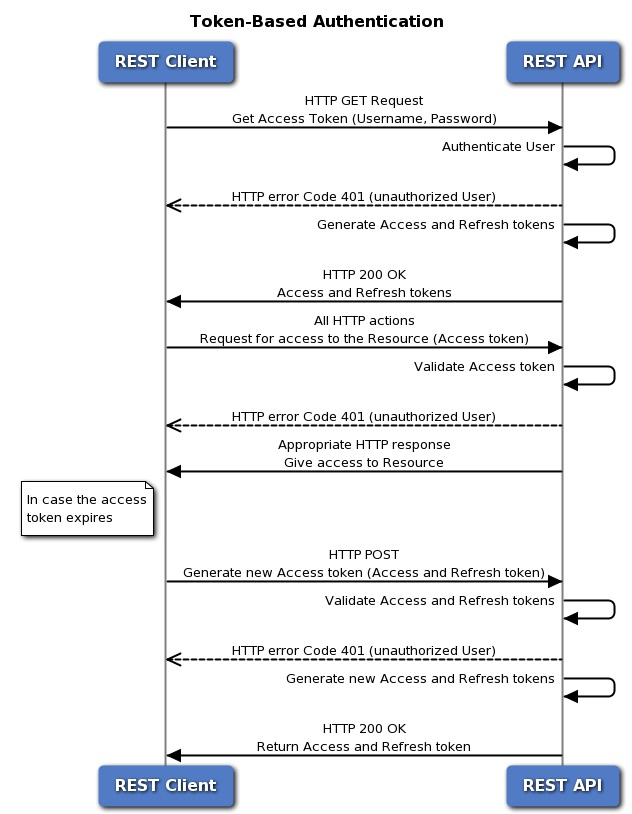

# Firepower Management Center (FMC) REST API authentication tokens

Learn how to use token-based authentication with the FMC REST API.

## Objectives

The objective of this lab is to learn how to:
1. Understand how token authentication works with the FMC REST API.
2. Request an authentication token.
3. Refresh a token.
4. Use a Python script to submit an authentication request.

## Prerequisites

To complete this lab you need:

* A development environment with typical tools and applications, as well as [Postman](https://www.getpostman.com/).
* Basic understanding of REST principles. Complete the [REST API Fundamentals Learning Lab](https://learninglabs.cisco.com/tracks/devnet-beginner/rest-api-fundamentals/what-are-rest-apis/step/1)
* Basic understanding of HTTP authentication.
* Basic understanding of FCM REST APIs and the FMC REST API Explorer. Complete [Exploring Firepower Management Center (FMC) REST APIs](https://learninglabs.cisco.com/modules/Firepower/firepower-restapi-101/step/1).

**Note**: The first time you connect to the FMC REST API you may receive an error that the connection is not secure due to an invalid certificate. Add an exception in your browser to use the certificate and accept the connection.

## Overview of FMC REST token authentication

Token-based authentication enables you to access an HTTP or HTTPS service for a limited time period without the need to enter a username and password with every request. The username and password credentials are replaced by with a uniquely generated access token, which enables access to resources for up to 30 minutes, and which can be refreshed up to three times.

When you are generating authentication tokens, be sure to use different credentials for authenticating with the FMC API and the FMC UI. Credentials cannot be used for both interfaces simultaneously, and will be logged out without warning if used for both.

The following diagram illustrates the concept of token-based authentication:

