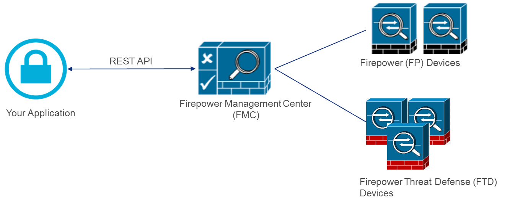

# Overview of adding NGIPS or NGFW sensors or devices to FMC

Let's look at this simple network setup with FMC and two devices:

Adding device or sensor to FMC is a *two* step process:

1. Add FMC on the sensor or device.
2. Register the device or sensor to the FMC.

There are two ways to register a device:
* FMC UI
* FMC REST API

For both methods, registering a device requires one CLI step on the device itself for both methods. The next sections in this Learning Lab will describe the procedures.

**Next**: Adding FMC on the device or sensor
