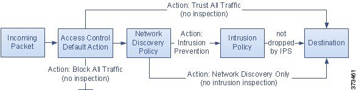
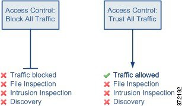
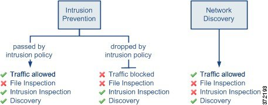

# Access control policy default action

In a simple access control policy, the default action specifies how target devices handles all traffic. In a more complex policy, the default action handles traffic that:

* is not trusted by Intelligent Application Bypass.
* is not blacklisted by Security Intelligence.
* is not blocked by SSL inspection (encrypted traffic only).
* matches none of the rules in the policy (except Monitor rules, which match and log—but do not handle
or inspect—traffic).

The access control policy default action can block or trust traffic without further inspection, or inspect traffic for intrusions and discovery data.

The following table lists different default actions and what they do to network traffic.

| Default Action                    | Effect on Traffic                                                      | Inspection Type and Policy                                                                                                     |
|:-----------------------------------|:------------------------------------------------------------------------|--------------------------------------------------------------------------------------------------------------------------------|
| Access Control: Block All Traffic | block without further inspection                                       | none                                                                                                                           |
| Access Control: Trust All Traffic | trust (allow to its final destination none without further inspection) | none                                                                                                                           |
| Intrusion Prevention              | allow, as long as it is passed by the intrusion policy you specify     | intrusion, using the specified intrusion policy and associated variable set, and discovery, using the network discovery policy |
| Network Discovery Only            | allow                                                                  | discovery only, using the network discovery policy                                                                             |
| Inherit from base policy          | defined in base policy                                                 | defined in base policy                                                                                                         |

 
The following diagrams provide visual representations of these actions.

**Next**: Access control policy inheritance
