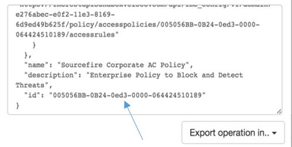

# Creating a threat-centric AC policy using the FMC API Explorer

Before you create your policy, log into the FMC API Explorer. Refer to the [Exploring FMC REST APIs Learning Lab](https://developer.cisco.com/learning/modules/Firepower/firepower-restapi-101/) for more information about logging in to the API explorer and reserving resources on the FMC REST API Sandbox.

1. Select **Policy** from the **API Info** menu.
2. Locate the following route: `/api/fmc_config/v1/domain/e276abec-e0f2-11e3-8169-6d9ed49b625f/policy/accesspolicies`. Click **POST**.
3. Copy the following JSON into the **body** field. Be sure to change the name of your policy to something unique.
```JSON
{
  "type": "AccessPolicy",
  "name": "My Enterprise Corporate AC Policy ",
  "description": "Enterprise Policy to Block and Detect Threats",
  "defaultAction": {
    "intrusionPolicy": {
      "name": "Security Over Connectivity",
      "id": "abba9b63-bb10-4729-b901-2e2aa0f4491c",
      "type": "IntrusionPolicy"
    },
    "variableSet": {
      "name": "Default Set",
      "id": "76fa83ea-c972-11e2-8be8-8e45bb1343c0",
      "type": "VariableSet"
    },
    "type": "AccessPolicyDefaultAction",
    "logBegin": false,
    "logEnd": true,
    "sendEventsToFMC": true
  }
}
```
4. Click **POST**. The response to the call will appear in the **Response Text** window.


The access control policy ID is in the response text. Look for the `"id"` line that is **not** nested under `domain`, as shown in the following sanmple code and image. **Be sure to record this ID**.

```JSON
"name": "Cisco AC Policy",
"description": "Enterprise Policy to Block and Detect Threats",
"id": "005056BB-0B24-0ed3-0000-064424512502"
```



**Next**: Creating access control rules
