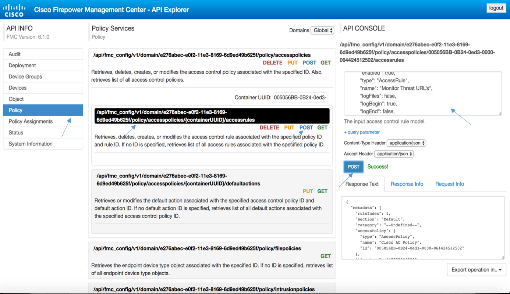

# Creating access control rules

This section demonstrates two examples of access control rules created in the context of the AC policy that you created in the previous step. The rules are created with the POST method and the access control rules route.


## Monitoring suspicious URLs

This rule monitors connections to suspicious URLs.
1. Select **Policy** from the **API Info** menu.
2. Select the following route: `/api/fmc_config/v1/domain/e276abec-e0f2-11e3-8169-6d9ed49b625f/policy/accesspolicies`. A list of related routes will appear below.
3. In the **Container UUID** field, enter the ID of the access control policy that you created in the previous step of this Learning Lab.
4. Locate the following route: `/api/fmc_config/v1/domain/e276abec-e0f2-11e3-8169-6d9ed49b625f/policy/accesspolicies/{containerUUID}/accessrules`.
5. Click **POST**.
6. In the API Console, use the following JSON to create the rule. Set the `name` to a name of your choosing.
```JSON
{
  "sendEventsToFMC": true,
  "action": "MONITOR",
  "enabled": true,
  "type": "AccessRule",
  "name": "Monitor Threat URLs",
  "logFiles": false,
  "logBegin": true,
  "logEnd": false,
  "variableSet": {
    "name": "Default Set",
    "id": "76fa83ea-c972-11e2-8be8-8e45bb1343c0",
    "type": "VariableSet"
  },
  "urls": {
    "objects": [{
      "name": "URL Exploitkit",
      "type": "SIURLFeed",
      "id": "A27C6AAE-8E52-4174-A81A-47C59FECf1c3"
    }, {
      "name": "URL Attackers",
      "type": "SIURLFeed",
      "id": "5a0b6d6b-e2c3-436f-b4a1-48248b333b57"
    }, {
      "name": "URL CnC",
      "type": "SIURLFeed",
      "id": "60f4e2ab-d96c-44a0-bd38-830252b67077"
    }, {
      "name": "URL Dga",
      "type": "SIURLFeed",
      "id": "b1df3aa8-2841-4c88-8e64-bfaacec71300"
    }, {
      "name": "URL Phishing",
      "type": "SIURLFeed",
      "id": "d7d996a6-6b92-4a56-8f10-e8506e434dd6"
    }, {
      "name": "URL Malware",
      "type": "SIURLFeed",
      "id": "23f2a124-8278-4c03-8c9d-d28fe08b8fc9"
    }],
    "urlCategoriesWithReputation": [{
      "type": "UrlCategoryAndReputation",
      "category": {
        "name": "Bot Nets",
        "id": "a774acd8-8240-11e0-9682-6814b504fd67",
        "type": "URLCategory"
      },
      "reputation": "WELL_KNOWN"
    }, {
      "type": "UrlCategoryAndReputation",
      "category": {
        "name": "Malware Sites",
        "id": "a774acd8-8240-11e0-9682-6814b504fd56",
        "type": "URLCategory"
      },
      "reputation": "WELL_KNOWN"
    }, {
      "type": "UrlCategoryAndReputation",
      "category": {
        "name": "Phishing and Other Frauds",
        "id": "a774acd8-8240-11e0-9682-6814b504fd57",
        "type": "URLCategory"
      },
      "reputation": "WELL_KNOWN"
    }, {
      "type": "UrlCategoryAndReputation",
      "category": {
        "name": "Spyware and Adware",
        "id": "a774acd8-8240-11e0-9682-6814b504fd59",
        "type": "URLCategory"
      },
      "reputation": "WELL_KNOWN"
    }, {
      "category": {
        "name": "Any",
        "type": "URLCategory"
      },
      "reputation": "SUSPICIOUS_SITES",
      "type": "UrlCategoryAndReputation"
    }]
  }
}
```
7. Click **POST**. The response to the call will appear in the **Response Text** window.

FMC REST API explorer API parameters screen shot


## Monitoring connections from internal hosts with a malware detection policy

To create a rule that monitors connections from internal hosts with a malware detection policy, follow the previous procedure and use the following JSON:
```JSON
{
  "sendEventsToFMC": true,
  "action": "ALLOW",
  "enabled": true,
  "type": "AccessRule",
  "name": "Malware Inspect",
  "logFiles": true,
  "logBegin": false,
  "logEnd": false,
  "variableSet": {
    "name": "Default Set",
    "id": "76fa83ea-c972-11e2-8be8-8e45bb1343c0",
    "type": "VariableSet"
  },
  "sourceNetworks": {
    "objects": [{
      "type": "NetworkGroup",
      "name": "IPv4-Private-All-RFC1918",
      "id": "15b12b14-dace-4117-b9d9-a9a7dcfa356f"
    }]
  },
  "filePolicy": {
    "name": "New Malware",
    "id": "59433a1e-f492-11e6-98fd-84ec1dfeed47",
    "type": "FilePolicy"
  }
}
```

**Next**: Sample Python script to create threat-centric AC policy
