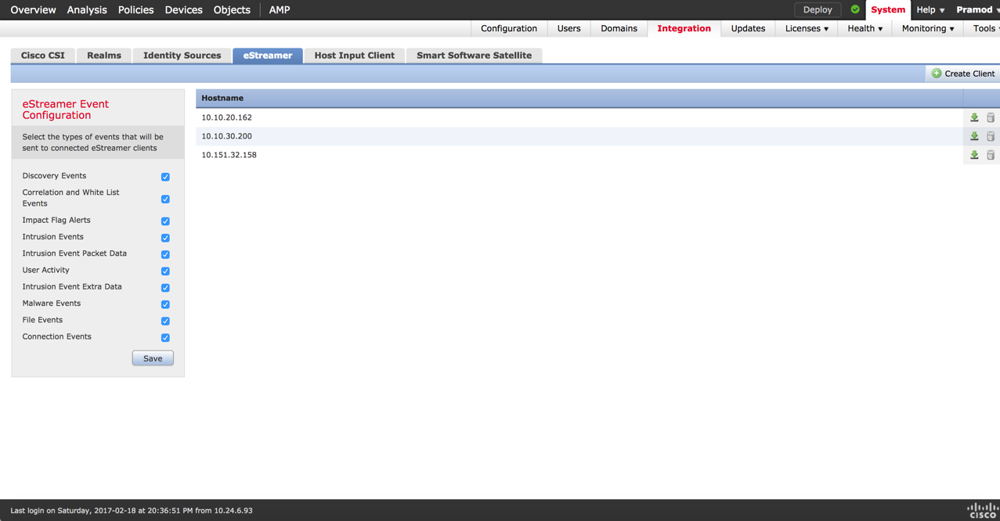
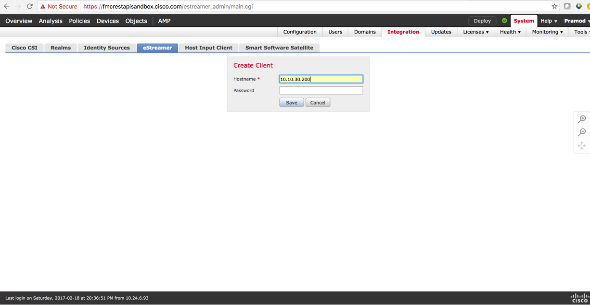

# Using the Event Streamer API to identify a potentially compromised host

## Objectives

This lab teaches you how to use the Event Streamer (eStreamer) API to extract events from the Firepower Management Center (FMC) and perform basic analysis of a potentially compromised host.

Once you complete this module, you will be able to use the eStreamer SDK reference client included in the eStreamer SDK to exchange messages with the FMC using the eStreamer application protocol. Analyze the events you have extracted from the FMC to determine activity that was logged around the time of a potential compromise of one or more hosts in your network.

## Prerequisites
It's best if you already have a basic understanding of Firepower Solutions and Firepower threat technologies.

### eStreamer reference client setup

* Setup the system you plan to use to run the eStreamer reference client by installing the following libraries:

    * The reference client uses the Secure Socket Layer (SSL) for data communication. You must install OpenSSL on the computer you plan to use as a client, and configure it appropriately for your environment.

    `Note: For initial installations on Linux operating systems, you must install the libssl- dev component as part of this download.`


    * Before you can run the eStreamer Perl reference client, you must install the IO::Socket::SSL Perl module the client computer. You can install the module manually, or use CPAN to do so.

    `Note If the Net::SSLeay module is not installed on the client computer, install that module as well. Net::SSLeay is required for communication with OpenSSL.`


* Configure the eStreamer server on the Firepower Management Center (FMC) to stream events of interest:

    


* Generate a certificate for the eStreamer client on the FMC, and copy the generated certificate to the system where you plan to run the eStreamer client. You can generate the certificate by doing these steps:


  * Choose **System** \> **Integration** \> **eStreamer**.
  * Click the **eStreamer** tab.
  * Click **Create Client**.
  * In the **Hostname** field, enter the host name or IP address of the host running the eStreamer client.

    `Note: If you have not configured DNS resolution, use an IP address.`

  * If you want to encrypt the certificate file, enter a password in the **Password** field.

  * Click **Save**. The eStreamer server now allows the host to access port 8302 on the eStreamer server, and creates an    authentication certificate to use during client-server authentication.

  * Click the download file icon () next to the client hostname to download the certificate file. Copy it to the system on which you plan to run the eStreamer client.

  * To revoke access for a client, click the delete icon () next to the host you want to remove. Note that you do not need to restart the eStreamer service; access is revoked immediately.

    `Note: In a multi domain deployment, you can create an eStreamer client in any domain. The authentication certificate allows the client to request events only from the client certificate's domain and any descendant domains. The eStreamer configuration page shows only clients associated with the current domain, so if you want to download or revoke a certificate, switch to the domain where the client was created.`

* From <https://developer.cisco.com/site/firepower/docs/downloads/estreamer-api/> download the version of the eStreamer SDK which matches the version of your FMC.

* Unpack the eStreamer SDK on the system you have setup to run your eStreamer reference client.

* Copy the eStreamer client certificate file to the directory which contains the reference client names `ssl\_test.pl`.

* Connect your client application to the FMC and begin exchanging data using the following command `./ssl\_test.pl \<FMC Hostname or IP\> –s=all`.

* A script to analyze events around a potential host compromise has been provided. Use the steps below to run the script, and examine the output to understand chronology of events around the potential compromise.

  * Run the estreamer client and dump the events to a file on disk:
```shell
>   ./ssl\_test.pl \<FMC Hostname or IP\> –s=all \> ./all\_events
```
  * Run the script:
``` shell
./identify\_compromised\_host.pl ./all\_events
```
